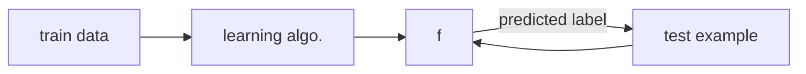

#autonomy #adaptability #efficiency #supervise #unsupervise #reinforcement #inductive-learning #loss-function #probabilistic-model #inductive-bias

[[00. ML Overview#^3e5928|common learning algorithms]], [[00. ML Overview#3. The Induction Framework#Types of Inductive Learning|types of inductive learning]], [[00. ML Overview#4. Prediction Accuracy|prediction accuracy]], [[00. ML Overview#5. Performance: Loss Function|loss function]], [[00. ML Overview#6. Inductive Bias|inductive bias]]

## 1. What is Machine Learning?
---
Machine learning is a process in which a computer program/algorithm improves its performance at some task through experience.


## 2. Subfields of ML
---
There are *supervised*, *unsupervised* and *reinforcement* learning. For now we focus on supervised learning algorithms.

The following sections list common approaches. ^3e5928

##### Supervised
How do we #supervise an algorithm?  What does it mean to supervise?  Supervision here means that *we provide a set of examples*, and then the *algorithm will use this set to produce* **predictions**.

First, we need to describe the *features*/attributes of the data set, i.e. *data representation*.  In the case of CSV format, the *feature values* are represented in comma-separated values.

```ad-note
The concept of *noise* will be discussed more in the future.  In brief, noise could appear as inaccurate labeling of data, for example.

```

- Tree:
	- [[01. Decision Trees|Decision Trees]]
	- Random forest
	- Regression Tree, Decision Stump, ...
- Instance:
	- [[02. Geometric Learning and KNN|KNN]]
- Kernel:
	- SVM
- Network:
	- [[04. Perceptron Decision Bounds|Perceptron]]
	- Linear Regression
	- Multi-layer
- Probabilistic Model:
	- Naive Bayes
	- Logistic Regression
	- Bayes Net, Deep Belief Net, Bayesian Optimal, ...

##### Unsupervised
- Clustering:
	- K-Means
	- DBScan
	- Hierarchical, Gaussian Mixture Models, ...
- Dimensionality Reduction:
	- PCA
	- SVD, LDA, ...
- Anomaly Detection
- Association Rule

##### Reinforcement
- Temporal Difference
- Q Learning
- MDP
- SARSA
- Deep Reinforcement Learning


## 3. The Induction Framework
---

```ad-info
title: What is inductive learning?

Given (i) a loss function $\ell$ and (ii) a sample $D$ from some unknown distribution $\mathcal{D}$, you must compute a function $f$ that has low expected error $\epsilon$ over $\mathcal{D}$ with respect to $f$.

*First introduced in [[01. Decision Trees]]*.
```



$f(x) \to y$
    where
	    $x$: examples
	    $y$: label

#### Types of Inductive Learning
1. Regression: falls back toward the *mean*
2. Binary classification: predicts a simple binary outcome
3. Multiclass classification: beyond binary outcomes to higher dimensional outcomes
4. Discovery
5. Reinforced learning

```ad-note
 *We focus on 1-4 for now.*
```

#### Example
$f(x) \to R^+$
$f(x) \to {0, 1} {+, -}$
$f(x) \to { NYC, SF, Pullman, CA }$


## 4. Prediction Accuracy
---
$$Accuracy  = \frac {\mbox{number of correct}}{\mbox{total}}$$


## 5. Performance: Loss Function
---
##### a. Loss Function
We use a loss function to measure the following qualities:
- against unseen test data (whether algorithm is *generalizable*)
- whether it is relevant to the problem being solved
- strong algorithmic relationship between the training data and test data

The loss function typically has two parameters $\ell(\cdot, \cdot)$. It tells us *how bad* is a system performing in predicting compared to the truth. For example, the following function $L$ is a measure of error:

$L(y, \hat{y})$ where
	$y$  = true label
	$\hat{y}$ = system prediction

*The loss function must be decided for every learning goal*. The loss function is used in:
- Regression:
	- *squared loss:*
		$$\ell(y, \hat{y})=(y-\hat{y})^2$$
	- *absolute loss:*
		$$\ell(y, \hat{y})=|y-\hat{y}|$$
- Binary classification:
	- *zero/one loss:*
		$$
		\ell(y, \hat{y})= \cases{ 0 & if $y=\hat{y}$ \cr
								   1 & otherwise }
		$$
- Multiclass classsification: also *zero/one loss*
- Discovery
- Reinforcement learning

##### b. Probabilistic Model
Given a probability distribution $\mathcal{D}$, the training algorithm must try to induce a function $f$ that should minimize *expected loss* $\epsilon$ over examples drawn from $\mathcal{D}$.

## 6. Inductive Bias

## 99. Other Key Ideas
---
- *training error*
- variance and bias
- sigmoid function
- probabilistic modeling
- naïve Bayes
