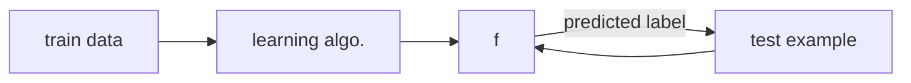

#autonomy #adaptability #efficiency #supervise #unsupervise #reinforcement-learning #inductive-learning 

[[00. ML Overview#^3e5928|common learning algorithms]], [[00. ML Overview#3. The Induction Framework#Types of Inductive Learning|types of inductive learning]], [[00. ML Overview#4. Prediction Accuracy|prediction accuracy]], [[00. ML Overview#5. Performance: Loss Function|loss function]], [[01. Decision Trees|decision trees]], [[02. Geometric Learning and KNN|geometric/KNN]], [[03. Clustering and Python ML Libs|clustering]], [[04. Perceptron Decision Bounds|perceptron]]


## 1. What is Machine Learning?
---
Machine learning is a process in which a computer program/algorithm improves its performance at some task through experience.


## 2. Subfields of ML
---
There are *supervised*, *unsupervised* and *reinforcement* learning. For now we focus on supervised learning algorithms.

How do we *supervise* an algorithm?  What does it mean to *supervise*?  Supervision here means that *we provide a set of examples*, and then the *algorithm will use this set to produce* **predictions**.

First, we need to describe the *features*/attributes of the data set, i.e. *data representation*.  In the case of CSV format, the *feature values* are represented in comma-separated values.

```ad-note
The concept of *noise* will be discussed more in the future.  In brief, noise could appear as inaccurate labeling of data, for example.

```

The following sections list common approaches. ^3e5928

#### Supervised Learning
- Tree:
	- [[01. Decision Trees|Decision Trees]]
	- Random forest
	- Regression Tree, Decision Stump, ...
- Instance:
	- [[02. Geometric Learning and KNN|KNN]]
- Kernel:
	- SVM
- Network:
	- [[04. Perceptron Decision Bounds|Perceptron]]
	- Linear Regression
	- Multi-layer
- Probabilistic Model:
	- Naive Bayes
	- Logistic Regression
	- Bayes Net, Deep Belief Net, Bayesian Optimal, ...

#### Unsupervised Learning
- Clustering:
	- K-Means
	- DBScan
	- Hierarchical, Gaussian Mixture Models, ...
- Dimensionality Reduction:
	- PCA
	- SVD, LDA, ...
- Anomaly Detection
- Association Rule

#### Reinforcement Learning
- Temporal Difference
- Q Learning
- MDP
- SARSA
- Deep Reinforcement Learning


## 3. The Induction Framework
---



$f(x) \to y$
    where
	    $x$: examples
	    $y$: label

#### Types of Inductive Learning
1. Regression: falls back toward the *mean*
2. Binary classification: predicts a simple binary outcome
3. Multiclass classification: beyond binary outcomes to higher dimensional outcomes
4. Discovery
5. Reinforced learning

```ad-note
 *We focus on 1-4 for now.*
```

#### Example
$f(x) \to R^+$
$f(x) \to {0, 1} {+, -}$
$f(x) \to { NYC, SF, Pullman, CA }$


## 4. Prediction Accuracy
---
$$Accuracy  = \frac {\mbox{number of correct}}{\mbox{total}}$$


## 5. Performance: Loss Function
---

$L(y, \hat{y})$
    where
        $y$  = true label
        $\hat{y}$ = 

Used in:
- Regression
- Binary classif.
- Multiclass classsif.
- Discovery
- Reinforcement learning


## 6. Other key ideas
---
- variance and bias
- sigmoid function
- probabilistic modeling
- naïve Bayes
