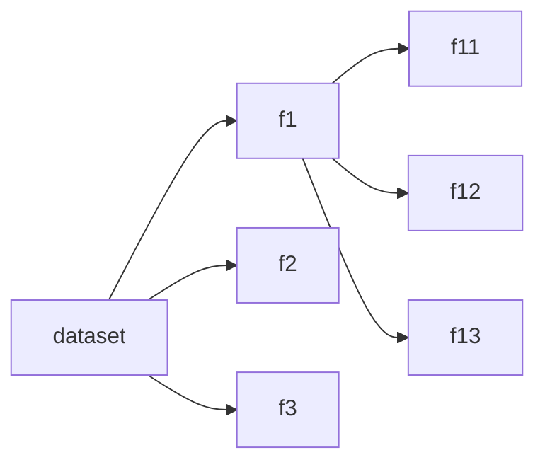

#cnn #convolutional-neural-network #convolutional-neural-network 

## 0. TODO
---
- [x] Make a copy of the Colab notebook provided by Dr. Cook
	- [x] Annotate:
		- [x] How to import image data
			- [x] `*.ni.gz` format import
		- [x] Choose features
		- [x] Set up essential statistics (mean, variance)
		- [x] MNIST, [Microsoft Paper](https://www.microsoft.com/en-us/research/wp-content/uploads/2003/08/icdar03.pdf)
- [ ] Design the model
	- [x] Set up our own Colab notebook
	- [x] Set up dataspace using Google Cloud or AWS (will look into which one later)
	- [ ] Modeling
		- [x] Choose a dataset
			- [x] [Functional MRI of emotional memory in adolescent depression](https://neurovault.org/collections/1015/)
			- [x] fMRI vs MRI Python/image support
				- [MRI data processing tutorial](https://www.datacamp.com/tutorial/reconstructing-brain-images-deep-learning)
				- [fMRI Python pipeline setup](https://www.preprints.org/manuscript/201904.0027/v2/download)
			- [ ] Decide whether we should and how we will normalize the data
		- [ ] Clean & Prep Data
			- [x] Import image set
			- [x] analyze the image data
				- [x] header: metadata
				- [x] image data: 3D (x, y, z)
				- [ ] affine:
		- [ ] Build & Test
			- [x] Decide on train/test partitions
			- [ ] Bootstrap
			- [ ] Cross-Validation

## I. Problem
---
We want to classify some dataset of neurological images into some binary conclusion, for example:
- either *healthy* or *diseased*
- either *before* or *after*

## II. Data
---
Because Convolutional Networks are best for processing and classifying image data, we choose data that contain only images.

[https://neurovault.org/collections/1015/](https://neurovault.org/collections/1015/) (Functional MRI of emotional memory in adolescent depression)

Our data set is a collection of 3D images. For example, a file imported into a numpy array with the shape (91, 109, 91) have three a total of $91\times 109\times 91=902629$ images.

Even those these are sparse arrays, even after we truncate, it is still a huge amount of information to be computed.

Therefore, *for this first model*, **we decided to fix each dimension of the image to the midpoint, producing three images for three dimensions** for each sample. We will apply convolution on each of these dimensional snapshot, producing a sub weight vector for each. Then, we will aggregate and compute the average weight vector from the three prior vectors. This average weight vector will then be used in back propagation.

##### Normalization
- bootstrapping/random sampling
- by feature
	- feature centering
	- feature scaling
- by example: easier to compare across the data sets.
$$
	x_n \leftarrow \frac{x_n}{||x_n||}
$$

##### Validation
- cross-validation (cycling through equisized partitions of the dataset)

## III. Solution
---
We use a [[11. Convolutional Neural Networks|convolutional neural network]] to perform binary classification on the data set. Thus our loss function is a **0/1 loss**.

For reference, the *objective* is to try to minimize this function:
$$
\DeclareMathOperator*{\min}{min}
\min_{w, b}\sum_n \boldsymbol{\underbrace{L}_{\mbox{0/1 loss}}}\cdot\underbrace{\boldsymbol{f_{\text{convolutional net}}}}_{\mbox{activation}} + \underbrace{\lambda\cdot R(w, b)}_{\mbox{hyperparameter }\boldsymbol{\cdot}\mbox{ regularizer}}
$$

#### 1. Loss Function
Since ours is a binary classification problem, we will use *logistic regression*. We will surrogate the **0/1 loss** function with a logistic loss function:
$$
\boldsymbol{L}^{logit}(y, \hat{y}) = \frac{1}{log2}log(1+\exp[-y\hat{y}])
$$

The following is the function form provided by [Google Machine Learning](https://developers.google.com/machine-learning/crash-course/logistic-regression/model-training):

$$
\begin{align}
&\boldsymbol{L}^{logit}(y,\hat{y}) = \sum_{(x,y)\in D} -y\log(\hat{y}) - (1 - y)\log(1 - \hat{y})\cr
&\quad\text{where:}\cr
&\quad\quad\text{- $(x,y)\in D$: the labeled examples as $(x,y)$ pairs in the dataset.}\cr
&\quad\quad\text{- $y$: a labeled example. Must either be 0 or 1.}\cr
&\quad\quad\text{- $\hat{y}$: the predicted value where $0 < \hat{y} < 1$, given the set of features in $x$.}
\end{align}
$$

> [!info] Review
> For reference, we have four common surrogate loss functions: **hinge loss**, **logistic loss**, **exponential loss** and **squared loss**. ^5b8bb3
> 
> - hinge: **linear growth** for $\quad\hat{y} < 0$.
> 	- Used in *SVM*
> $$
> \DeclareMathOperator*{\max}{max}
> \ell^{hinge}(y, \hat{y}) = \max\{0, 1-y\hat{y}\}
> $$
> - logistic/log: **linear growth** for $\quad\hat{y} < 0$. 
> $$
> \ell^{logit}(y, \hat{y}) = \frac{1}{log2}log(1+\frac{1}{e^{y\hat{y}}})
> $$
> ^404f78
> - exponential: **super-linear growth** for $\quad\hat{y}<0$.
> $$
> \ell^{exp}(y, \hat{y}) = \exp[-y\hat{y}]
> $$
> - square: **super-linear growth** for $\quad\hat{y}<0$.
> 	- Used in *linear regression*
> $$
> \ell^{exp}(y, \hat{y}) = (y-\hat{y})^2
> $$
> 

#### 2. Activation/Link function
We have four options for our activation function:

- ReLU

- sigmoid

- softmax

- tanh
$$
\begin{align}
\hat{y}&=\sum v_i\cdot\tanh(w_i, \boldsymbol{\hat{x}})\cr
&=\boldsymbol{v}\cdot \tanh(\boldsymbol{W\cdot\hat{x}})
\end{align}
$$

#### 3. Weight regularization
Because ours is a neural network, we use back-propagation and gradient descent to regularize the weight vector.

- L1
- L2
- Dropout
