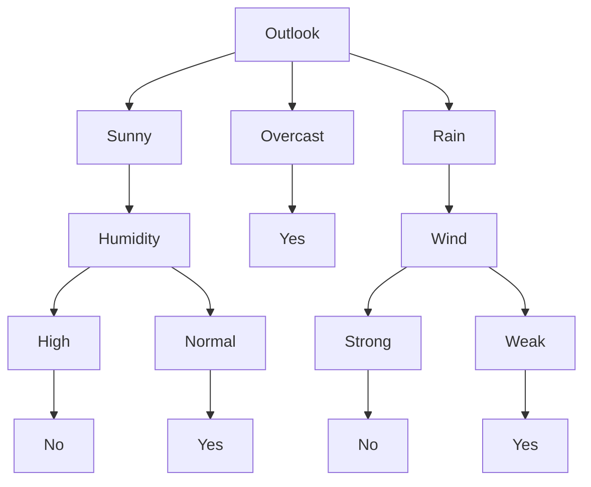

#decision #decision-tree #practical-considerations

## 1.  Characteristics
---
- [[00. ML Overview#3. The Induction Framework|inductive learning]]
- Discrete class values
- Disjunctive hypothesis
- Can handle noisy training data

**Example decision tree:**

Given the following data:
| DAY | Outlook  | Temp | Humidity | Wind   | Play |
| --- | -------- | ---- | -------- | ------ | ---- |
| 1   | Sunny    | Hot  | High     | Weak   | No   |
| 2   | Sunny    | Hot  | High     | Strong | No   |
| 3   | Overcast | Hot  | High     | Weak   | Yes  |
| 4   | Rain     | Mild | High     | Weak   | Yes  |
| 5   | Rain     | Cool | Normal   | Weak   | Yes  |
| 6   | Rain     | Cool | Normal   | Strong | No   |
| 7   | Overcast | Cool | Normal   | Strong | Yes  |
| 8   | Sunny    | Mild | High     | Weak   | No   |
| 9   | Sunny    | Cool | Normal   | Weak   | Yes  |
| 10  | Rain     | Mild | Normal   | Weak   | Yes  |
| 11  | Sunny    | Mild | Normal   | Strong | Yes  |
| 12  | Overcast | Mild | High     | Strong | Yes  |
| 13  | Overcast | Hot  | Normal   | Weak   | Yes  |
| 14  | Rain     | Mild | High     | Strong | No   |

The following decision tree is generated:

- *nominal features* (as opposed to continuous features), i.e. they are labels instead of values.

Given a decision tree, each path from root to leaf is a conjunction of all the attributes along the path.  Furthermore, this means that the tree is the disjunction of all the possible paths.

A greedy top-down decision is less computationally expensive.

## 2. Entropy
---
Decision tree is inspired by information theory.  Thus, entropy applies and is a measure of the degree of noise/impurity of the data set.

$$Entropy(S) = p_{+}log_2p_{+} - p_{-}log_2p_{-}$$
$$Gain(S, A) = Entropy(S) - \sum_{\nu \in Values(A)} \frac{|S_\nu|}{S} Entropy(S_\nu)$$

## 3. Practical Considerations
---
- How to use tree
- Continuous feature values
- **Depth limit/pruning**
- Overfitting
- Underfitting
- Inconclusive leaves
- Missing values