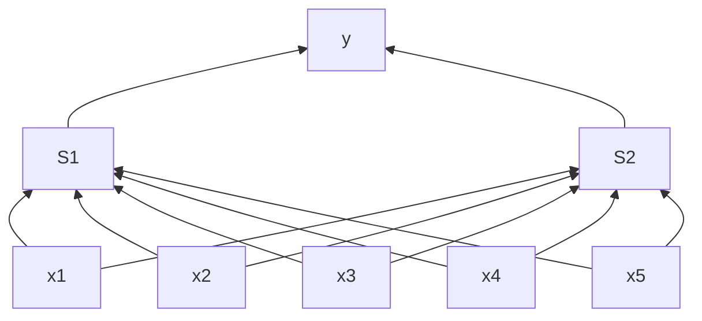

#neural-networks #multi-layer #activation-function #link-function #back-propagation

## 0. Algorithm
---
The neural networks are an extended version of perceptrons. Perceptrons are called *single-layer* networks because there is only one layer of weights. This is due to the fact that each input is connected directly to one output/label.

On the other hand, for neural nets, we put one or more layers of *hidden* nodes between the input and ouput, effectively creating a multi-layer network. Furthermore, this introduces *non-linearity* and thus *non-linear boundaries*. The tradeoff for this is increased complexity in parameter tuning and model design.

The graph above is an example of a 2-layer network, or *two layers of trained weights*. We do not consider the input a real layer. **Neural network prediction is a generalization of perceptron prediction**. First, we compute activations for the hidden layer based on the inputs and input weights. Then, we feed the computed activations to the output layer to calculate the final activations.

**A major difference with perceptron is the *non-linear function* used in the hidden layers**. This function is called #activation-function or #link-function .

There are some popular link functions:
- **sign** function (non-differentiable)
- the more popular **hyperbolic tangent**/**sigmoid** function
	- the derivative is $1- tanh^2(x)$

	<iframe src="https://www.desmos.com/calculator/yadcyoxvsi?embed" width="500" height="250" style="border: 1px solid #ccc" frameborder=0></iframe>

##### sigmoid function
*Reference: page 130.*

> [!note]
> Let's assume we use this function as our activation function. It takes a matrix of weights $\boldsymbol{W}$ (the input layer) and a vector of weights $v$ (the second layer), and compute the our prediction:
> $$
> \DeclareMathOperator{\tanh}{tanh}
> \begin{aligned}
> \hat{y} &=\sum_i v_i\cdot\tanh(w_i\cdot\hat{x}) \cr
>		&=v\cdot \tanh(\boldsymbol{W}\cdot \hat{x}) \cr
> \end{aligned}
> $$

---
##### TwoLayerNetWorkPredict(W, $v$, $\hat{x}$)
---
**for** $i = 1$ **to** *number of hidden nodes*  **do**:
	$h_i \leftarrow$ tanh$(w_i \cdot \hat{x})$                              // compute the activation of hidden unit $i$
**return** $v\cdot h$                                             // compute the ouput unit

---

## 1. Back Propagation
---
*Reference: page 132.*

>[!important]
> back-propagation = [[07. Linear Models and Optimization#4. Gradient Descent|gradient descent]] + chain rule

##### gradient descent
> [!info]
> [[07. Linear Models and Optimization#4. Gradient Descent|gradient descent]]

##### chain rule

2. *Initialization* and *convergence* of neural nets
3. 2+ layers

## 4. Breadth vs Depth, Deep Networks
---
##### Strategies for training deep neural networks
- *layer-wise* initialization: use unlabeled data to initialize the weights better
- use more complex optimization procedure other than gradient descent
