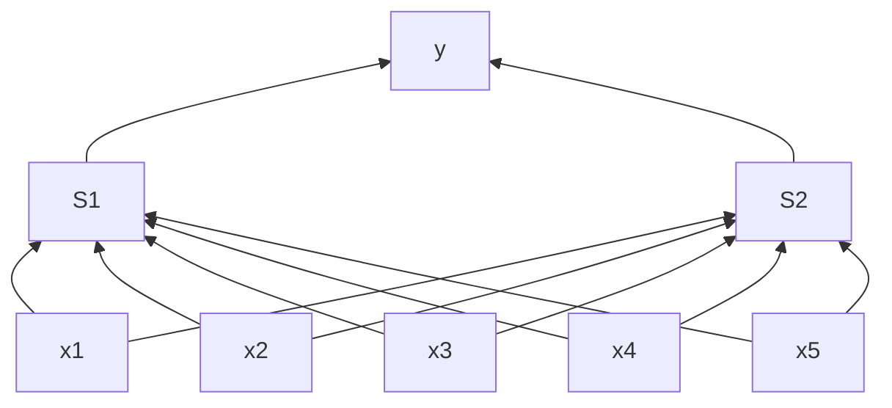

#neural-networks #multi-layer 

The neural networks are an extended version of perceptrons. Perceptrons are called *single-layer* networks because there is only one layer of weights. This is due to the fact that each input is connected directly to one output/label.

On the other hand, for neural nets, we put one or more layers of *hidden* nodes between the input and ouput, effectively creating a multi-layer network. Furthermore, this introduces *non-linearity* and thus *non-linear boundaries*. The tradeoff for this is increased complexity in parameter tuning and model design.

The graph above is an example of a 2-layer network, or *two layers of trained weights*. We do not consider the input a real layer. **Neural network prediction is a generalization of perceptron prediction**. First, we compute activations for the hidden layer based on the inputs and input weights. Then, we feed the computed activations to the output layer to calculate the final activations.

A major difference with perceptron is the non-linear function used in the hidden layers. This function is called #activation-function or #link-function .

There are some popular link functions:
- **sign** function (non-differentiable)
- **hyperbolic tangent** , or **sigmoid**, function (more popular)

1. *Back-propagation*
2. *Initialization* and *convergence* of neural nets
3. 2+ layers
4. Breadth vs Depth